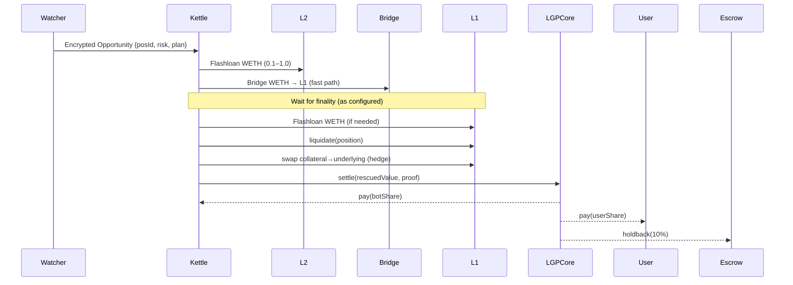

# Liquidity Ghost Protocol (LGP) – Technical Specification

**Version:** 1.0  
**Status:** Draft for implementation  
**Date:** 2025-08-08

---

## 0. Purpose & Scope
LGP is a **bot-first, permissionless liquidation-rescue and latency-arbitrage layer**. It intercepts imminent liquidations and MEV-sensitive flows, privately bundles a cross-chain rescue, and returns 70–85% of the saved value to the originator while taking a protocol fee. The MVP targets **Ethereum L1 + Base L2** with optional expansion.

**Goals**
- Protect users from forced liquidations and predatory MEV by executing profitable rescues.
- Be fully non-custodial and privacy-preserving (SUAVE kettles; encrypted bundles).
- **No bonds** for searchers; use reputation + earnings holdback to mitigate grief.
- Launchable with **≤ 2 ETH** working capital per chain.

**Non-Goals (MVP)**
- Custom ZK proving systems; we lean on SUAVE/TEE privacy.
- General-purpose intent router or swap aggregator.

---

## 1. High-Level Architecture
```mermaid
flowchart LR
  subgraph OffChain[Off-chain]
    W[Liquidation Watcher] --> Cx[Classifier Engine (HRM+Rules)]
    Cx --> OF[Opportunity Feeder]
    OF -->|encrypted intents| K[SUAVE Kettle: Rescue]
    K -->|bundle| RB[Relays/Builders]
  end

  subgraph OnChain[On-chain Contracts]
    LGP[LGPCore] <--> Esc[EarningsEscrow]
    LGP <--> Rep[Reputation]
    LGP <--> FSp[FeeSplitter]
    LGP <--> FA[FlashloanAdapter]
    LGP <--> BA[BridgeAdapter]
  end

  RB -->|private bundle txs| L1[(Ethereum L1)]
  RB -->|private bundle txs| L2[(Base L2)]

  L1 <--> BA
  L2 <--> BA
  L1 <--> FA

  style K fill:#1b263b,stroke:#4cc9f0,color:#fff
  style LGP fill:#14213d,stroke:#fca311,color:#fff
```

### 1.1 Components
Liquidation Watcher (off-chain): Indexes lending markets (Aave v3, Compound v3, Morpho) and flags near-liquidation positions.

Classifier Engine: Hybrid HRM tree + rules; outputs risk_score ∈ [0,100] and a proposed rescue plan.

Opportunity Feeder: Publishes encrypted opportunity intents to the SUAVE kettle.

SUAVE Rescue Kettle: Attested TEE that assembles a cross-chain bundle using the Flashloan + Bridge adapters; submits to builders privately.

LGPCore (on-chain): Orchestrates settlement, fee logic, earnings holdback.

EarningsEscrow: Temporarily escrows 10% of protocol/bot earnings for 24h to allow fraud-proofs.

Reputation: Stores landed-bundle ratio, gas-waste, revert rates for each kettle key.

FeeSplitter: Splits revenue among protocol, kettle, and optional referrer.

FlashloanAdapter: Same-chain flash loans (Aave v3 or Uniswap v3) to finance gas/repayment legs.

BridgeAdapter: LayerZero OFT or canonical bridge helper; handles L1↔L2 value transfer.

## 2. Execution Flows
### 2.1 Liquidation Rescue (L2→L1 example)


### 2.2 Failure & Revert Handling
If any leg fails, kettle reverts the bundle; flash loans auto-revert; only relay fees may burn.

If bridge latency exceeds window, kettle switches to same-chain only rescue or abandons.

## 3. Smart Contracts (Solidity Interfaces)
### 3.1 LGPCore
```solidity
interface ILGPCore {
  struct RescueReceipt {
    address user;
    address market; // target lending protocol
    address debtAsset;
    address collateralAsset;
    uint256 debtRepaid;
    uint256 collateralClaimed;
    uint256 userPayout;    // after protocol fee
    uint256 botPayout;     // after holdback
    bytes32 opportunityId; // hash of off-chain plan
  }

  event RescueExecuted(bytes32 indexed opportunityId, address indexed kettle, address indexed user, uint256 savedValue);
  event HoldbackLocked(address indexed kettle, uint256 amount, bytes32 receiptHash);
  event HoldbackReleased(address indexed kettle, uint256 amount, bytes32 receiptHash);
  event FraudProved(bytes32 indexed receiptHash, address prover, uint256 slashed);

  function settle(RescueReceipt calldata r, bytes calldata kettleAttestation, bytes calldata proofs) external;
  function protocolFeeBps() external view returns (uint16);
  function holdbackBps() external view returns (uint16); // default 1000 = 10%
}
```

### 3.2 Reputation
```solidity
interface ILGPReputation {
  event ScoreUpdated(address indexed kettle, uint64 landed, uint64 wasted, uint64 reverts);
  function scoreOf(address kettle) external view returns (uint64 landed, uint64 wasted, uint64 reverts);
  function bump(address kettle, bool landedBundle, bool reverted) external; // only LGPCore
}
```

### 3.3 EarningsEscrow
```solidity
interface IEarningsEscrow {
  function lock(address kettle, uint256 amount, bytes32 receiptHash) external; // only LGPCore
  function proveFraud(bytes32 receiptHash, bytes calldata proof) external;     // anyone
  function release(bytes32 receiptHash) external;                               // after TTL
}
```

### 3.4 FlashloanAdapter (Aave v3 default)
```solidity
interface IFlashloanAdapter {
  function loanAndCallback(address asset, uint256 amount, bytes calldata data) external;
}
```

### 3.5 BridgeAdapter
```solidity
interface IBridgeAdapter {
  function send(address token, uint256 amount, uint16 dstChainId, bytes calldata memo) external payable;
  function receive(bytes calldata payload) external; // called by bridge endpoint
}
```

## 4. Kettle Logic (SUAVE)
Inputs: Encrypted Opportunity with fields: market, user, healthFactor, debtAsset, collateralAsset, minProfitUsd, deadlines, chain route.

Pseudocode

```python
op = decrypt(intent)
assert now < op.deadline

# Step 1: Confirm profitable window
quote = sim_rescue(op)
if quote.profitUsd < op.minProfitUsd:
    abort()

# Step 2: Finance legs
if op.srcChain == "L2":
    l2_flashloan(op.debtAsset, op.debtAmount)
    bridge_to_L1(op.debtAsset, op.debtAmount)

# Step 3: Execute rescue on L1
l1_flashloan_if_needed()
liquidate(op.market, op.user)
swap_collateral_to_underlying()

# Step 4: Settle on-chain
receipt = build_receipt(...)
send_tx(LGPCore.settle, receipt, attestations, proofs)
Reputation update is called by LGPCore based on bundle outcome.
```

## 5. Parameters & Config (MVP Defaults)
```
protocolFeeBps = 1500 (15%)

userShare = 70–85% (set by policy; user gets delta after fees)

holdbackBps = 1000 (10% of kettle earnings, 24h lock)

minProfitUsd = $80 (covers gas + 0.09% flash fee + buffer)

maxSlippageBps = 50 per swap leg

bridgeTimeout = 8 minutes (fallback to same-chain)

chains = {Ethereum:L1, Base:L2}
```

## 6. External Integrations
Lending protocols: call public liquidate() methods; no permissions required.

Flash loans: Aave v3 (preferred) or Uniswap v3 flash swaps; fee ≈ 0.09%.

Bridges: LayerZero OFT WETH wrapper or canonical; small LP seed (≈0.5 ETH/chain) recommended.

Relayers (optional): Gelato ERC-2771 for meta-tx sponsorship.

Builders/Relays: Flashbots, Titan, Eden — private bundle inclusion.

## 7. Data & APIs
### 7.1 Public endpoints (read-only)
`/.well-known/savings.json`

```json
{
  "version": 1,
  "window": "hour",
  "rescues": 42,
  "saved_usd": 51234.12,
  "user_payout_usd": 40987.29,
  "protocol_revenue_usd": 7685.12,
  "top_markets": ["AaveV3-ETH", "CompoundV3-Base"],
  "last_updated": "2025-08-08T00:00:00Z"
}
```

`/leaderboard.json` – per-kettle landed bundles, net PnL.

`/opportunities.json` – sanitized, delayed feed for transparency (not real-time to avoid leak).

### 7.2 Internal schemas
Opportunity: {id, market, chainRoute, riskScore, deadline, debtAsset, debtAmount, collateralAsset, minProfitUsd}

Receipt: on-chain struct (see ILGPCore).

## 8. Security Model & Threats
### Trust assumptions

Kettle code runs in attested TEE (SUAVE); secrets and strategies remain private until execution.

Contracts are immutable or timelocked; protocol is non-custodial.

### Threats & Mitigations

Front-running / order leakage → Encrypted bundles via SUAVE; no public mempool exposure.

Bridge latency / reorgs → Use fast-finality paths; bridgeTimeout fallback; small L1 buffer (0.5–1 ETH).

Griefing by kettles → Reputation degradation + earnings holdback slashing via fraud proofs.

Oracle manipulation → Prefer robust oracle sources; perform pre-rescue sanity checks.

Sequencer downtime (L2) → Circuit breaker to same-chain rescues only.

## 9. Gas & Cost Model (MVP)
L1 liquidation: 300–600k gas typical; L2 legs 150–300k.

Flash loan fee: 0.09% on borrowed notional (Aave v3).

Expected min profitable rescue: $80–$120 surplus after gas.

## 10. Deployment Plan
### Environments

Local: Foundry + Anvil + Hardhat; SUAVE devnet.

Testnet: Sepolia (L1) + Base Sepolia (L2).

Mainnet: Ethereum + Base.

### Steps

1. Deploy LGPCore, EarningsEscrow, Reputation, FeeSplitter to Sepolia.
2. Deploy FlashloanAdapter (Aave v3 testnet) and BridgeAdapter (mock or LayerZero test).
3. Stand up SUAVE kettle(s) with attestation.
4. Connect builders (Flashbots test relay).
5. Run synthetic rescues; verify savings.json updates.
6. Promote to mainnet with low limits.

### Config flags

- paused (global)
- per-market allowlist (Aave, Compound, Morpho identifiers)
- per-chain gas caps

## 11. Testing Strategy
Unit: Foundry tests for fee math, holdback lifecycle, reputation updates.

Integration: Tenderly fork tests simulating liquidation/repay/swap.

Chaos: Randomized bridge delays; reorg simulations; revert paths.

Load: Kettle submits 100 rescues/hour; measure landed ratio, gas burn.

### Acceptance Criteria (MVP)

- ≥ 85% landed bundles under normal conditions.
- Mean user payout accuracy ±0.5% vs quote.
- Holdback releases automatically after TTL; fraud-proof path slashes.

## 12. Observability & Ops
Metrics: rescued value, landed rate, avg surplus, per-market hit rate, kettle PnL, revert reasons.

Dashboards: Grafana/Prometheus + public savings.json.

Alerts: health factor spikes, landed ratio <70%, gas spikes, bridge delays.

## 13. Roadmap (90 days)
- Weeks 0–2: Deploy on testnets; single-market (Aave v3 USDC-ETH) rescues.
- Weeks 3–6: Add Base; bridge adapter; publish dashboard.
- Weeks 7–8: Earnings holdback + fraud-proofs; open private alpha (your kettles only).
- Weeks 9–12: Reputation gating; optional third-party kettle registry (no bonds).

## 14. Default Parameters (Appendix)
```
PROTOCOL_FEE_BPS = 1500

HOLD_BACK_BPS = 1000

HOLD_BACK_TTL = 24h

MIN_PROFIT_USD = 80

BRIDGE_TIMEOUT = 8m

MAX_SLIPPAGE_BPS = 50
```

## 15. Open Questions (to resolve during MVP)
- Which bridge path offers the best fast-finality for WETH between Base↔L1 under stress?
- Should holdback be dynamic (higher for low-rep kettles)?
- Is a minimal user-opt-in RPC (LGP-Protect) worth adding in MVP for more order flow?
- Where to cap per-rescue gas to avoid tail-risk on volatile spikes?

End of spec
